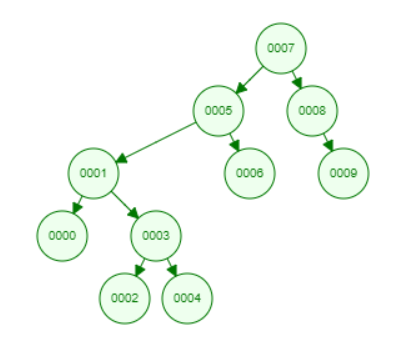

# Binary search tree sıralamsı
- [7, 5, 1, 8, 3, 6, 0, 9, 4, 2] dizisinin Binary-Search-Tree sıralayalım.

- 7 elemanı parent düğüm olarak 
eklenir.
* 
 * İlk olarak 7 eleamnı root düğüm olarak belirlenir.Ağacın en başında bulunur.
 * 5 elemanı 7 ile karşılaştırılır ve 7 den küçük olduğu için rootun soluna yerleşir.
 * 1 elemanı 7 ve 5 ile karşılaştırılır 5 ten küçük olduğu için 5 in soluna yerlesşir
 * 8 elemanı 7 den büyük olduğu için 7 nin sağına yerleşir. 
 * 3 elemanı 7 den küçük ve 5 ten de küçük olduğu için sol tarafa bakılır. 1 den büyük olduğu için 1 in sağına yerleştirilir.
 * 6 elemanı 7 den küçük fakat 5 ten büyük olduğu için 5 in sağına yerleştirilir.
 * 0 elemanı 7->5->1 yolunu takip ederek 1 in soluna yerleşir.
 * 9 elemanı 7->8 yolunu takip ederek 8 in sağına yerleştirilir.
 * 4 elemanı 7->5->1->3 yolunu takip ederek 3 ün sağına yerleşir.
 * 2 elemanı 7->5->1->3 yolunu takip ederek 3 ün soluna yerleşir.